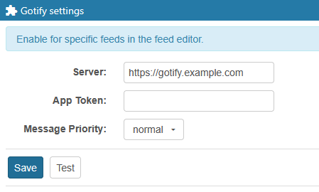

# Gotify for Tiny Tiny RSS

A Tiny Tiny RSS plugin for sending push notifications with Gotify on new articles. Requires a [Gotify server](https://gotify.net/).

## Installation

### Git

1. Clone the repo to **gotify_notifications** in your tt-rss **plugins.local** directory:

   `git clone https://github.com/VerifiedJoseph/ttrss-plugin-gotify gotify_notifications`

2. Enable the plugin @ Preferences → Plugins